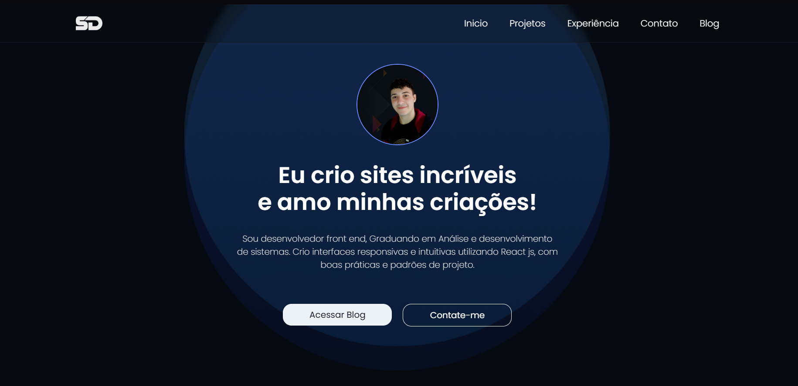

# 💼 Portfólio — Samuel S. (LoopCode)

Bem-vindo ao meu **portfólio profissional V01**, um espaço criado para apresentar meus projetos, habilidades e experiências como **Desenvolvedor Front-end**.  
Este portfólio foi desenvolvido com foco total em **performance**, **design moderno** e **experiência do usuário**, trazendo uma navegação fluida e uma identidade visual limpa e profissional.

A proposta é entregar uma vitrine clara do meu trabalho, destacando meus projetos, meu estilo de desenvolvimento e a evolução da minha jornada na programação.

---

## 🚀 Sobre o Portfólio

Meu portfólio foi construído como uma landing page interativa que apresenta:

- Projetos desenvolvidos com foco em design e funcionalidade  
- Habilidades técnicas e ferramentas que domino  
- Seções organizadas e intuitivas  
- Animações suaves para criar uma experiência mais viva e envolvente  
- Layout responsivo e adaptado para qualquer dispositivo  

A ideia é que qualquer pessoa — seja cliente, recrutador ou parceiro — consiga visualizar de forma rápida e agradável os trabalhos que já desenvolvi e como eu atuo como dev.

---

## 🛠️ Tecnologias Utilizadas

Este projeto foi desenvolvido utilizando um conjunto de tecnologias que garantem praticidade, performance e estética:

- **HTML5** — marcação organizada e semântica  
- **CSS3** — estilização responsiva, moderna e elegante  
- **JavaScript** — lógica, interações e efeitos dinâmicos  
- **Chakra UI** — componentes acessíveis, responsivos e personalizados  
- **AOS Animate** — animações on-scroll leves e fluidas  

---

## ✨ Funcionalidades

- Página completamente responsiva  
- Animações de entrada suaves e profissionais  
- Seções separadas: Sobre mim, Projetos, Habilidades e Contato  
- Design com foco em clareza e impacto visual  
- Fácil manutenção e expansão futura  

---

## 📸 Demonstração

